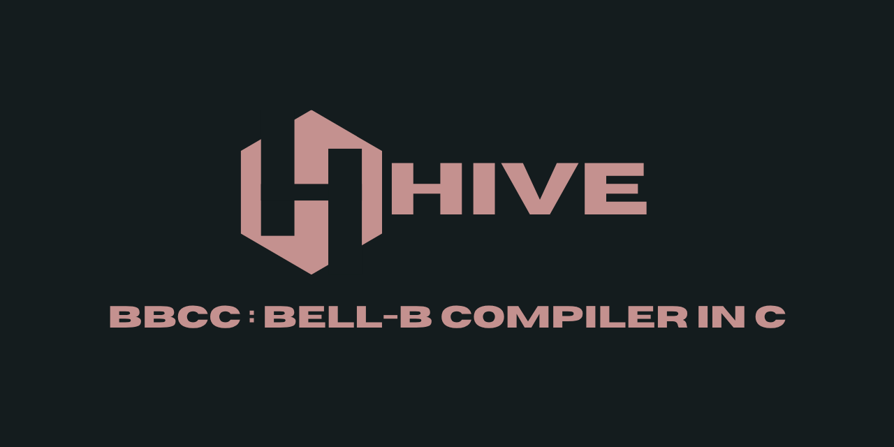

<p align="center">
  
</p>

<h1 align="center">HIVE-BBCC</h1>

<p align="center">
  <a href="https://github.com/parixitsapkota/tridentc">
    
  </a>
  <a href="https://github.com/parixitsapkota/tridentc/commits/">
    
  </a>
</p>

<p align="center">
  <strong>Hive</strong> is a compiler for the <strong>B programming language</strong> written in <strong>C</strong>, targeting <strong>amd64</strong> (NASM) assembly.<br>
<strong>B</strong> is a typeless systems programming language developed by Ken Thompson and Dennis Ritchie at Bell Labs—the direct predecessor to <strong>C</strong>.
</p>

---



## Prerequisites

### Required

- **C Compiler (`CC`)**: Defaults to `clang`.
- **`make`**: Build system used for building, running, and testing.
- **`nasm`**: Netwide Assembler for emitting x86-64 assembly.
- **`gperf`**: Perfect hash generator for O(1) keyword/symbol lookup.

### Optional

- **`clang-format`**: For formatting the C source code.

---

## Quick Start

### Build and Run Example

```bash
make
make run EXAMPLE=examples/hello_world.b

```

### Release Build (Linux)

```bash
make clean all PLATFORM=linux MODE=release

```

---

## Configuration & Notes

> [!NOTE]
> You can override the default C compiler by setting `CC`:
>
> ```bash
> $ make CC=gcc
> ```

> [!WARNING]
> Linux is the primary target platform. Support for other operating systems is experimental.

---

## Roadmap

- [ ] Improved error reporting and diagnostics ( with historical errors. )
- [ ] Add switch statements.
- [ ] Add break statements in loops.
- [ ] Add continue statements in loops.
- [ ] Add syntactic sugar (e.g., `=+`, `=-`, `=*`)

---

<p align="center">
  <a href="https://github.com/parixitsapkota/tridentc/blob/main/LICENSE">
    
  </a>
</p>

**Hive** is licensed under the **Apache 2.0 License**.
